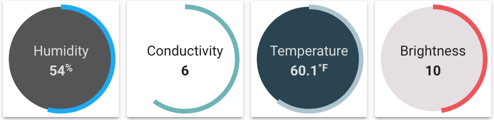

Custom component for lovelace which can be used as a card or an element on a picture-elements card.



**Note: When including this file in your `ui-lovelace.yaml` you must use `type: module`**

## Config

| Name | Type | Description | Default
| ---- | ---- | ----------- | -------
| type | string | `custom:circle-sensor-card` | **Required**
| entity | string | `sensor.temperature` | **Required**
| show_card | boolean | Render as a card | `false`
| name | string | Name to display above sensor value | none
| min | number | Minimum value | `0`
| max | number | Maximum value | `100`
| font_size | string | Base font size | `1em`
| font_color | string | Font color | `#0D0D0D`
| fill | string | Background color of circle | `rgba(255, 255, 255, .75)`
| stroke_width | number | Width of circle value indication ring | `6`
| stroke_color | hex code | Default stroke color | `#03a9f4`
| color_stops | object | Sensor value to color mapping (see below) | none
| gradient | boolean | Whether to smoothly transition between color stops | `false`
| units | boolean | Display units of measurement | `true`

### Color stops
A mapping from `value` to `color`. If `gradient` is set to true, mid-stop colors will be
calculated on a linear gradient from one stop to the next.

```yaml
color_stops:
  50: '#84B821'
  100: '#D43214' 
```

## Installation

### Step 1

Install `circle-sensor-card` by copying `circle-sensor-card.js`from this repo to `<config directory>/www/` on your Home Assistant instance.

**Example:**

```bash
wget https://raw.githubusercontent.com/custom-cards/circle-sensor-card/master/circle-sensor-card.js
mv circle-sensor-card.js /config/www/
```

### Step 2

Link `circle-sensor-card` inside you `ui-lovelace.yaml`.

```yaml
resources:
  - url: /local/circle-sensor-card.js?v=0
    type: module
```

### Step 3

Add a custom card or custom element in your `ui-lovelace.yaml` using `type: custom:circle-sensor-card`

## Example
```yaml
- type: custom:circle-sensor-card
  entity: sensor.outside_temperature
  max: 120
  min: 30
  stroke_width: 10
  font_size: 1.5em
  gradient: true
  units: false
  color_stops:
    50: '#55FF55'
    75: '#5555FF'
    100: '#FF5555'
  style:
    top: 50%
    left: 50%
    width: 75px
    height: 75px
```
